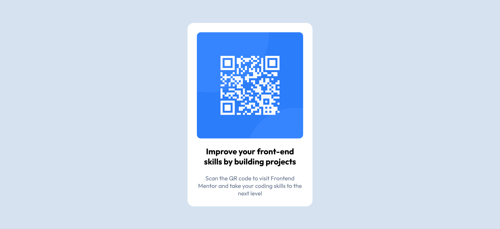

# Frontend Mentor - QR code component solution

This is a solution to the [QR code component challenge on Frontend Mentor](https://www.frontendmentor.io/challenges/qr-code-component-iux_sIO_H). Frontend Mentor challenges help you improve your coding skills by building realistic projects. 

## Table of contents

- [Overview](#overview)
  - [Screenshot](#screenshot)
  - [Links](#links)
- [My process](#my-process)
  - [Built with](#built-with)
  - [What I learned](#what-i-learned)
- [Author](#author)

## Overview

### Screenshot

### Links

- Solution URL: [Add solution URL here](https://github.com/vishpant76/qrCodeComponent)
- Live Site URL: [Add live site URL here](https://vishpant76.github.io/qrCodeComponent/)

## My process

### Built with

- Semantic HTML5 markup
- CSS properties
- Flexbox
- Mobile-first workflow

### What I learned

- Writing semantic HTML.

- How to use flexbox for centering elements/components on the page.

- Controlling images by width instead of height. Using width to define how big the card is, and letting height to follow naturally based on image's shape.

## Author

- Frontend Mentor - [@vishpant76](https://www.frontendmentor.io/profile/vishpant76)

